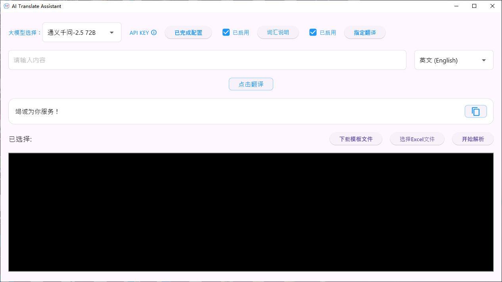
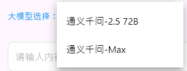
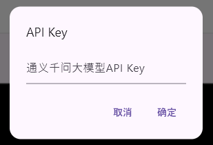
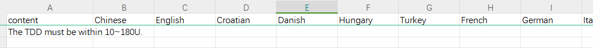
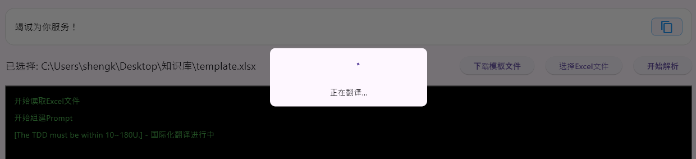
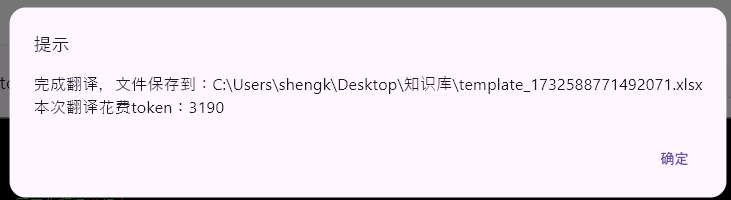
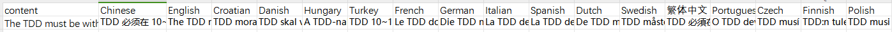

# AI Translate Assistant(AI翻译助手)
使用AI完成国际化翻译的工作

### 开发目的：

> 尝试使用AI大模型对软件开发的国际化翻译进行辅助工作

#### 界面说明

##### 1. 选择大模型

当前提供两种大模型：

- 通义千问2.5 72B（够用性价比高）

- 通义千问Max（阿里最新）

##### 2.大模型API_KEY设置

点击感叹号可以跳转通义千问API_KEY的申请界面，请自行购买并设置

点击按钮，进行配置

##### 3. 基础翻译

常规的翻译动作，右侧可以选择不同输出语言，输入语言也没有任何限制

##### 4. Excel翻译脚本

- 下载模板文件：点击后下载翻译脚本

  

  - 第一行设置需要翻译的目标语言

  - 第一列设置需要翻译的内容

    

- 选择设置好的翻译文件，然后点击开始解析

- 执行完成之后结果会自动保存在选择文件目录

  

  - 每次执行都会消耗token，所以对于大批量的翻译而言需要谨慎操作

  

- 结果会自动填写在Excel中

